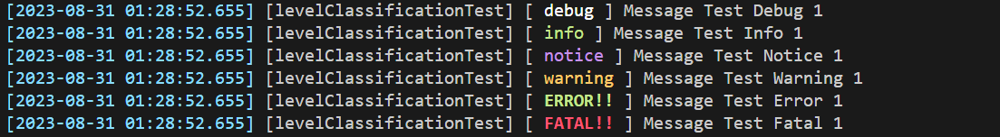

# Flogger 
> Quick and easy to use logging library for Modern Fortran applications

## Features

* Fast and lightweight logging library
* Text highlighting
* Log filtering
* Save logs to logfile

### Snippets / Examples

```f90
    type(FloggerUnit) :: flogs = FloggerUnit("levelClassificationTest")
    call flogs%debug("Message Test Debug 1")
    call flogs%info("Message Test Info 1")
    call flogs%notice("Message Test Notice 1")
    call flogs%warning("Message Test Warning 1")
    call flogs%error("Message Test Error 1")
    call flogs%fatal("Message Test Fatal 1")
```


## Getting Started

1. `USE` the flogger module

    for every program scope, you need to `USE` the flogger module with this following command 
    ```f90
    USE Flogger
    ```

2. Initiate the FloggerUnit with identifier

    You can initialize multiple instances of `FloggerUnit` and give different labels for each unit. Here's how to initiate the `FloggerUnit` object
    ```f90
    type(FloggerUnit) :: flogMain = FloggerUnit("ClassMainTest")
    type(FloggerUnit) :: flogMidDebug = FloggerUnit("MiddleDebug")
    type(FloggerUnit) :: flogMidWarning = FloggerUnit("MiddleWarning")
    ```
3. `call` the logging subroutines

    To make the log message you need to call the object methods from the corresponding `FloggerUnit` instances as follows.
    ```f90
    call flogs%debug("Message Test Debug 2")
    call flogs%notice("Message Test Notice 2")
    call flogMidWarning%warning("Message Test Warning 4")
    call flogMidWarning%error("Message Test Error 4")
    call flogMidDebug%fatal("Message Test Fatal 4")
    call flogMidDebug%info("Message Test Info 2")
    ```

4. Set flogger options

    Flogger logging behavior can be changed using `SET_FLOGGER_OPTIONS` subroutine. Here is the example
    ```f90
    call SET_FLOGGER_OPTIONS(Level=FLOGS_SET_RELEASE)   ! set to release mode
    call SET_FLOGGER_OPTIONS(Level=FLOGS_SET_SILENT)    ! set to silent mode
    call SET_FLOGGER_OPTIONS(FileOutput=.true.)         ! make flogger build logfiles
    ```

## Documentations
*under development...*

## Author
**Arif Y. Sunanhadikusuma (Soen)** <br>
--- <br>
[](https://linkedin.com/in/arifyunando)
[](mailto:arifyunando@gmail.com)<br>
_Civil Engineering (S.T.)_ <br>
Department of Civil Engineering <br>
Parahyangan Catholic University, Indonesia  <br> 
--- <br>
_Geotechnical Engineering (M.Sc)_ <br>
Civiel Techniek en Geowetenschappen (CiTG) <br>
TU Delft, The Netherlands